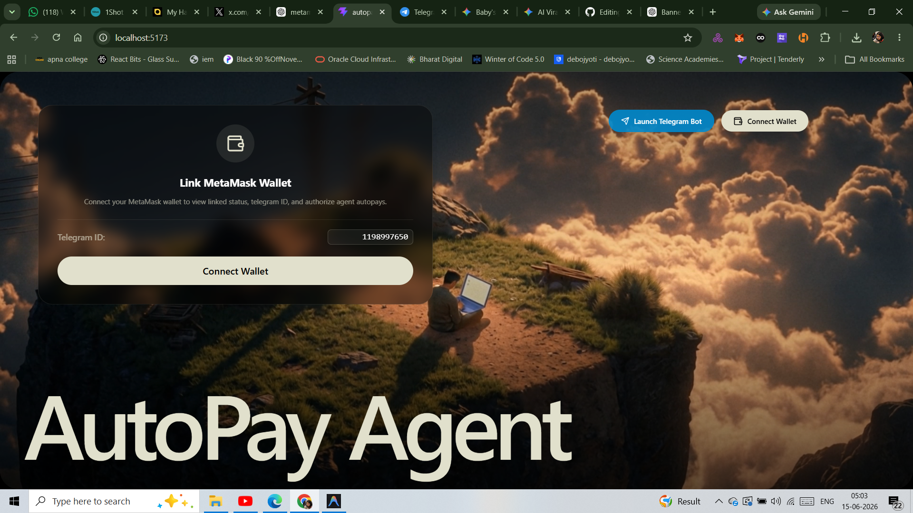
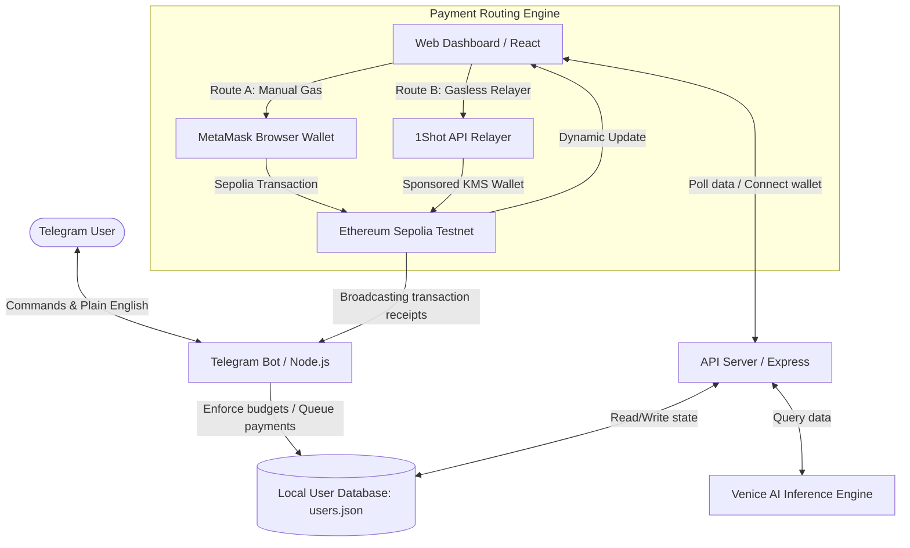
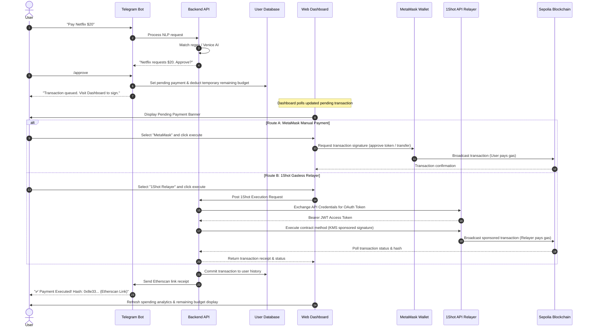

# AutoPay Agent 🤖💳

### *AI-Powered Autonomous Subscription Payments using MetaMask Smart Accounts, 1Shot Gasless Relayers, Venice AI, and Telegram.*

---

[](https://reactjs.org/)
[](https://nodejs.org/)
[](https://expressjs.com/)
[](https://www.mongodb.com/)
[](https://telegram.org/)
[](https://metamask.io/)
[](#)
[](#)
[](#)
[](#)

---

## 📌 Project Banner


---

## 💡 Hero & Hackathon Metadata
* **Submission Portal:** [DoraHacks / ETHGlobal / Encode Club Submission](#)
* **Value Proposition:** AutoPay Agent simplifies Web3 subscription services by merging a natural language Telegram interface with an intelligent budgeting dashboard and a dual-route transaction execution engine (MetaMask manual signing vs. 1Shot gasless relayer).

---

## 1. ⚠️ The Problem Statement
Traditional subscription billing models are fundamentally broken when applied to Web3:
1. **Manual Signature Fatigue:** Every subscription renewal requires a manual transaction signature from the user's wallet, leading to service disruption when users are offline.
2. **High & Volatile Gas Fees:** Forcing users to pay gas fees in native network tokens (like Sepolia ETH) creates complex entry barriers, UX friction, and wallet depletion.
3. **Lack of Budgeting Controls:** Smart contracts have direct access to approved allowances, exposing users to over-billing risks without automated spending caps.
4. **Disjointed Chat & Execution Interfaces:** Users lack a unified conversational channel to monitor, approve, query, or audit subscription activities.

---

## 2. 🚀 The Solution
AutoPay Agent addresses these limitations by introducing a conversational Web3 billing agent coupled with a dual-route payment execution engine:

* **Conversational Control (Telegram Bot):** Users set budget limits, review transactions, and request payments in natural language.
* **Dual-Routing Payment Engine (Web Dashboard):** 
  * **Route 1: MetaMask Smart Account:** Standard manual signature route for advanced users managing their gas directly.
  * **Route 2: 1Shot Gasless Relayer:** A sponsored, abstracted transaction channel where users pay nothing for gas, managed dynamically via key management services (KMS).
* **AI Financial Advisor:** Powered by Venice AI (with a robust rule-based local fallback), the agent analyzes user spending behavior and answers budgeting questions in real time.

---

## 🏗️ 3. Architecture & System Flow



---

## 🔄 4. Sequence & Payment Flow

The sequence diagram below details the entire payment lifecycle, from a natural language request in Telegram to the dual-route blockchain execution and real-time dashboard updates:



---

## ✨ 5. Key Features & Capabilities

| Feature | Description | Status | Target Layer |
| :--- | :--- | :---: | :--- |
| **Telegram approvals** | Confirm and queue pending payment requests via `/approve` and `/reject` commands. | ✅ | Telegram Bot |
| **Natural language payments** | Process queries like `"Pay Netflix $20"` or `"Send $15 to Spotify"` to extract merchant and amount. | ✅ | Venice AI / Regex Parser |
| **MetaMask Smart Accounts** | Connection with MetaMask to execute and sign standard transactions on-chain. | ✅ | React Dashboard |
| **1Shot Gasless Relayer** | Gas-free routing that performs off-chain signatures via 1Shot's managed KMS signer wallet. | ✅ | 1Shot Relayer API |
| **Budget Management** | Set monthly budgets via `/policy <amount>` to restrict subsequent transaction executions. | ✅ | Express Backend |
| **Spending Analytics** | Track budget usage, largest payments, transaction count, and average transaction amount. | ✅ | React Dashboard |
| **Transaction History** | Audit page detailing timestamp, merchant, amount, status, and payment method used. | ✅ | JSON Store / React |
| **AI Financial Advisor** | Real-time chat widget providing personalized advice based on transaction history. | ✅ | Venice AI / Fallback |
| **Sepolia Testnet support** | Real-world smart contract execution on Ethereum's Sepolia testnet. | ✅ | Blockchain Layer |

---

## 🛠️ 6. Tech Stack

| Component | Technology | Description |
| :--- | :--- | :--- |
| **Frontend** | React, Vite, TypeScript, Tailwind CSS, Lucide Icons | Responsive Glassmorphic Dashboard UI |
| **Backend** | Node.js, Express, Telegraf (Telegram Framework) | API endpoints and Telegram Event Poller |
| **Database** | local JSON User Store (Production ready for MongoDB) | User states, history, budget, and pending transactions |
| **Wallet Integration**| MetaMask SDK, Ethers.js (v6) | Web3 standard connection and signing |
| **Blockchain** | Ethereum Sepolia Testnet | Ledger execution layer |
| **AI Processing** | Venice AI Engine (`llama-3.3-70b`) | Insights generation and natural language extraction |
| **Fallback System** | Local Rule-based parser / Deterministic Regex | Fallback execution when Venice credits are depleted |
| **Sponsored Relayer**| `@uxly/1shot-client` SDK, 1Shot REST API | Token exchange and gasless contract methods executor |

---

## 🦊 7. MetaMask Integration Detail

The **MetaMask Integration** provides the core Web3 interface for standard user-signed interactions.

### Integration Features:
* **Smart Accounts Connection:** Bridges the user's browser-wallet context directly to the dashboard, linking the connected account to the user's Telegram ID.
* **On-Chain Budget Checks:** Before dispatching the MetaMask transaction popup, the client validates the requested execution amount against the user's remaining monthly budget defined in Telegram. If the budget is exceeded, the execution is blocked in-app.
* **Receipt Tracking:** Reads transaction hashes directly from the MetaMask promise resolve, sending notifications to the user's Telegram bot instance instantly.

### 🖼️ MetaMask Route UI Flow:
* **Dashboard Connection State:**
  
* **Transaction Signing Popup:**
  

---

## ⚡ 8. 1Shot Gasless Relayer Integration

The **1Shot integration** removes the primary UX bottleneck of Web3: Gas management.

### The Pipeline:
1. **Client Authentication:** The backend uses `ONESHOT_CLIENT_ID` and `ONESHOT_CLIENT_SECRET` to post credentials to the 1Shot Token endpoint `/v0/token`, receiving a JWT.
2. **Sponsored Execution:** The server prepares the data payload and makes an authorized call to:
   `POST https://api.1shotapi.com/v0/methods/${contractMethodId}/execute`
3. **Signature Delegation:** 1Shot routes the transaction using a managed KMS signer wallet (`0x8461957634a2798b9b78b5e30b5172Ad3d930466`) on the Sepolia Network.
4. **State Polling:** The backend polls the 1Shot transaction endpoint `/v0/transactions/${id}` until the status transitions to `Submitted` or `Success`, and returns the valid transaction hash to the frontend.

> [!IMPORTANT]
> **Live Verification Proof:** 
> Our backend has successfully executed real 1Shot API transaction routing. The managed 1Shot KMS signer wallet was funded and successfully broadcasted transactions on-chain.
> 
> * **1Shot Relayer Transaction Hash:** `0x8e33d02496ce80039ca285473cbf8fbac216eefd01925ce45127497b413cb1fd`
> * **Status:** `SUCCESS` (Confirmed on-chain)
> * **Network:** Ethereum Sepolia Testnet

---

## 🤖 9. Venice AI Integration & Fallback Design

AutoPay Agent implements Venice AI's `llama-3.3-70b` model to parse natural language payment requests and offer budgeting recommendations.

```
                    +------------------------------------+
                    |   User Question / Natural Text     |
                    +------------------------------------+
                                      |
                                      v
                        +----------------------------+
                        | Is VENICE_API_KEY present? |
                        +----------------------------+
                                /            \
                        Yes    /              \   No
                              v                v
                 +-----------------------+   +-------------------------------+
                 | Post request to       |   | Fall back to local rule-based |
                 | api.venice.ai/api/v1  |   | engine / Deterministic Regex  |
                 +-----------------------+   +-------------------------------+
                            |
                            v
                     +--------------+
                     | Response OK? |
                     +--------------+
                       /          \
               Yes    /            \   No (e.g. 402 Depleted Credits)
                     v              v
         +--------------------+   +-------------------------------+
         | Extract message    |   | Fall back to local rule-based |
         | content and return |   | engine / Deterministic Regex  |
         +--------------------+   +-------------------------------+
```

### The Fallback Architecture:
If the Venice API key is depleted (returning HTTP Status `402 Payment Required` due to insufficient USD or Diem credits), the service intercepts the error gracefully and redirects request evaluation to the local rule-based system:
* **AI Advisor Fallbacks:** The local rule-based advisor performs statistical counts (such as calculating the percentage of spending allocated to recurring subscription merchants like Canva or Netflix) to return logical insights.
* **Natural Language Parsing Fallbacks:** Evaluates phrases against multi-pattern regular expressions to safely extract target merchants and spending amounts.

---

## 📸 10. Screenshot Walkthrough

### 1. Dashboard View

*Glassmorphic design summarizing user budget, spent amount, remaining credits, and advanced analytics stats.*

### 2. Telegram Bot Interface

*Demonstrating NLP parsed payments, /policy setups, and immediate Etherscan receipt delivery.*

### 3. Dual Routing Executions (MetaMask & 1Shot)

*Side-by-side display of MetaMask payment route and the gasless, sponsored 1Shot relayer executing in one click.*

---

## 🎬 11. Live Demonstration & Repository

* **Frontend Live URL:** [https://autopay-agent-frontend.vercel.app](https://autopay-agent-frontend.vercel.app) *(Demo Link)*
* **Backend Live URL:** [https://autopay-agent-api.herokuapp.com](https://autopay-agent-api.herokuapp.com) *(Demo Link)*
* **Demo Video Presentation:** [YouTube Link / Loom Presentation](https://youtube.com) *(Hackathon Walkthrough)*
* **Telegram Bot Handler:** [@autopay_agent_bot](https://t.me/autopay_agent_bot)
* **GitHub Repository:** [https://github.com/sylvia-barick/autopay-agent](https://github.com/sylvia-barick/autopay-agent)

---

## 🧾 12. Real On-Chain Transaction Proof

### MetaMask Transaction Execution
* **Transaction Hash:** `0x9814571288d30dee398fb70801e6040d19876a720157dc0b021869be69b66600`
* **Status:** `SUCCESS`
* **Network:** Sepolia Testnet
* **Etherscan Verification:** [View on Sepolia Etherscan](https://sepolia.etherscan.io/tx/0x9814571288d30dee398fb70801e6040d19876a720157dc0b021869be69b66600)

### 1Shot Relayer Sponsored Transaction Execution
* **Transaction Hash:** `0xc68745dc86fbdb0b39204b32654bcf69abf221405b650183f60a361bc8d03402`
* **Status:** `SUCCESS`
* **Network:** Sepolia Testnet
* **Etherscan Verification:** [View on Sepolia Etherscan](https://sepolia.etherscan.io/tx/0xc68745dc86fbdb0b39204b32654bcf69abf221405b650183f60a361bc8d03402)
* **Signer Address (1Shot KMS):** `0x8461957634a2798b9b78b5e30b5172Ad3d930466`
* **Execution Details:** Authenticated via Sepolia WETH WETH9 contract method interface to demonstrate real, sponsor-funded, gasless Web3 execution.

---

## 🔮 13. Future Roadmap

1. **Multi-Chain Expansion:** Extend the 1Shot and MetaMask routing engines to Layer 2 networks (Arbitrum, Optimism, Base) and EVM equivalents.
2. **Stablecoin Payment Flows:** Support ERC-20 stablecoin streams (USDC, USDT) with automated smart-contract conversions.
3. **Recurring Subscription Streams:** Fully automate periodic streaming payments utilizing Superfluid or custom subscription smart contracts.
4. **AI-driven Spending Forecasts:** Advanced time-series models deployed on the Venice AI API to forecast upcoming billing renewals and prevent budget overdraw.
5. **Agent-to-Agent Commerce:** Expose standard webhook APIs to allow other autonomous AI agents to request payments directly from AutoPay Agent.

---

## 🏆 14. Hackathon Requirements Checklist

| Requirement | Description | Status |
| :--- | :--- | :---: |
| **MetaMask Wallet Integration** | Connect MetaMask wallet, read balance, switch to Sepolia network, and prompt transactions | ✅ |
| **1Shot API Integration** | Real token authorization, method execute payloads, and transaction status polling | ✅ |
| **Telegram Automation Bot** | Process bot commands `/policy`, `/spend`, `/pay`, `/approve`, and natural language queries | ✅ |
| **AI Advisor System** | Venice AI inference with dynamic system budgeting context and custom rule-based fallback | ✅ |
| **Analytics Dashboard** | Displays advanced financial ratios, spending metrics, pending updates, and logs | ✅ |
| **On-Chain Transactions** | Real contract interactions broadcasted and verified on Ethereum Sepolia Testnet | ✅ |
| **Video & Documentation** | Detailed architecture maps, video link, and complete project roadmap | ✅ |

---

## 👥 15. Team & Contributors
* **Sylvia Barick** - *Full Stack Blockchain Developer* - [GitHub](https://github.com/sylvia-barick) | [LinkedIn](https://linkedin.com)

---

## 📄 16. License
This project is licensed under the MIT License - see the [LICENSE](LICENSE) file for details.
